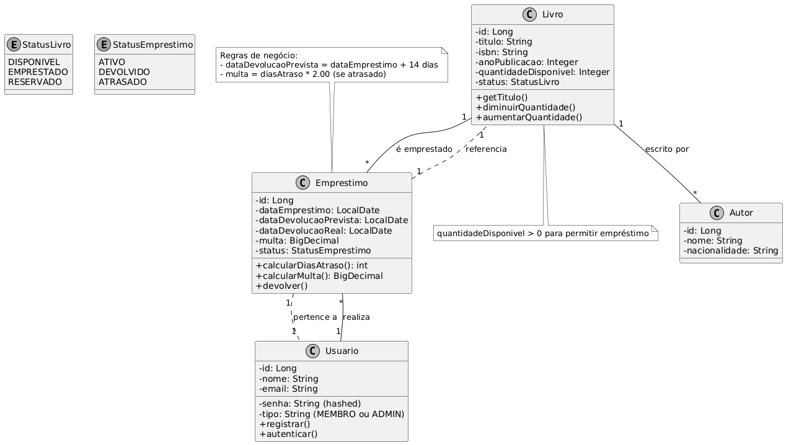

# Net-teca

## TODO List / Checklist de Desenvolvimento

Aqui está o progresso do projeto. Marquei o que já está implementado ou planejado.

### Fase 1: Setup e Estrutura Básica
- [X] Criar projeto com Spring Initializr (Java 17/21, Spring Boot 3.x)
- [X] Configurar `pom.xml` com dependências principais (Web, Data JPA, Security, Lombok, PostgreSQL Driver, Validation)
- [X] Configurar `application.yml` ou `application.properties` (datasource PostgreSQL, JPA hibernate.ddl-auto=update, etc.)
- [X] Configurar Git: init, .gitignore padrão Java/Spring, primeiro commit
- [X] Rodar a aplicação vazia sem erros (mvn spring-boot:run)

### Fase 2: Modelagem do Domínio (Entidades JPA)
- [X] Criar entidade `Livro` (@Entity, atributos, Lombok, enum StatusLivro)
- [X] Criar entidade `Autor`
- [X] Criar entidade `Usuario` (com senha hashed via BCrypt)
- [X] Criar entidade `Emprestimo` (datas, multa, status, relacionamentos)
- [X] Configurar relacionamentos JPA corretos (@ManyToOne, @OneToMany, etc.)
- [X] Criar repositórios (JpaRepository para cada entidade)
- [X] Testar criação automática de tabelas no banco (rode a app)

### Fase 3: Camada de Serviço (Business Logic)
- [x] Criar `LivroService` (CRUD + buscar por título/autor + verificar disponibilidade)
- [X] Criar `UsuarioService` (registro, autenticação básica)
- [x] Criar `EmprestimoService` (lógica principal: emprestar, devolver, calcular multa/dias atraso, exceções customizadas)
- [x] Implementar regras de negócio (ex: não emprestar se quantidade == 0, data devolução +14 dias)

### Fase 4: Camada de API REST (Controllers)
- [x] Criar `LivroController` (GET all/disponíveis, POST, PUT, DELETE)
- [x] Criar `EmprestimoController` (POST emprestar, PUT devolver, GET por usuário)
- [X] Criar `UsuarioController` (registro/login)
- [x] Usar DTOs para request/response (ex: EmprestimoRequestDTO, EmprestimoResponseDTO)
- [ ] Adicionar validações (@Valid, Bean Validation: @NotBlank, @Positive, etc.)
- [ ] Retornar ResponseEntity com HTTP status corretos (201 Created, 404 Not Found, etc.)

### Fase 5: Segurança (Spring Security + JWT)
- [x] Configurar SecurityConfig (WebSecurityConfigurerAdapter ou nova forma com SecurityFilterChain)
- [x] Implementar autenticação JWT (filter, token generation)
- [x] Endpoints de auth: /auth/register e /auth/login
- [ ] Proteger rotas (ex: empréstimos só para autenticados, CRUD livros para ADMIN)
- [ ] Roles básicas (MEMBRO vs ADMIN)

### Fase 6: Testes
- [ ] Testes unitários nos Services (JUnit 5 + Mockito)
- [ ] Testes de integração (ex: @SpringBootTest para controllers ou endpoints)
- [ ] Cobertura mínima: testar cenários felizes e de erro (ex: livro indisponível)

### Fase 7: Infra e Deploy
- [ ] Configurar Docker (Dockerfile para a app)
- [ ] Criar docker-compose.yml (app + postgres)
- [ ] Testar local com Docker (docker-compose up)
- [ ] Deploy gratuito (Railway, Render ou Fly.io) – link no README

### Fase 8: Documentação e Portfólio
- [ ] Criar README.md completo (descrição, tecnologias, endpoints em tabela, como rodar)
- [ ] Adicionar diagrama de classes UML (Mermaid ou imagem PlantUML)
- [ ] Criar coleção Postman/Insomnia e exportar (ou descrever endpoints)
- [ ] Adicionar prints de tela (ex: Postman responses, Swagger se usar)
- [ ] Commit final organizado + push para GitHub
- [ ] Atualizar LinkedIn com link do repo + deploy

### Extras (se der tempo / para destacar mais)
- [ ] Busca avançada em livros (Specification ou @Query)
- [ ] Relatórios simples (ex: empréstimos ativos)
- [ ] Cache com Spring Cache
- [ ] Integração com email (Spring Mail para notificação de devolução)

## UML

